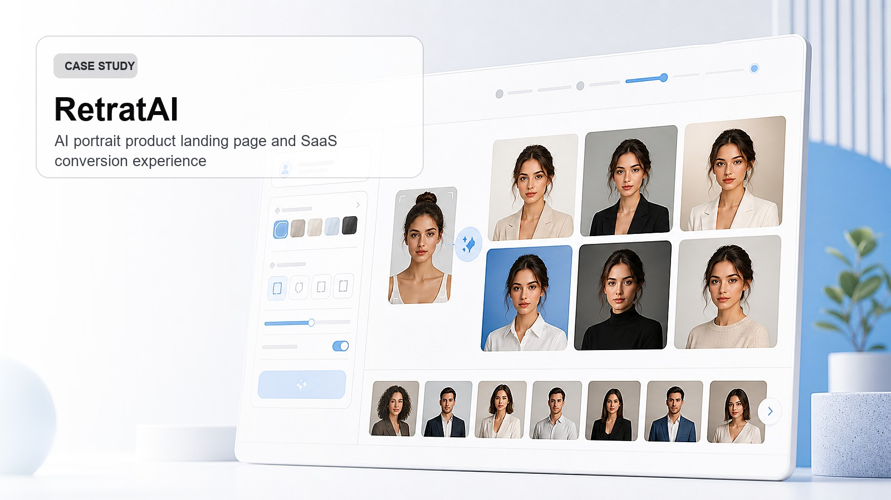
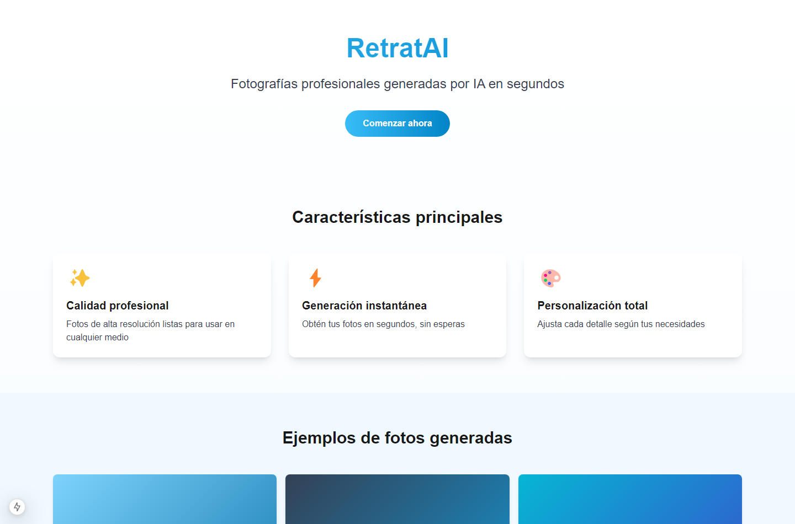

# RetratAI

RetratAI is a Next.js landing experience for an AI portrait product. It presents the offer, benefits, generated-photo examples, pricing tiers and conversion calls to action in a responsive marketing page.



Portfolio cover generated for presentation. Runtime screenshot:



## What it demonstrates

- Product-oriented landing page structure with hero, feature cards, gallery, pricing and CTA.
- Responsive layout built with Tailwind CSS.
- Clean visual hierarchy for a consumer AI product.
- A simple foundation for extending into onboarding, payment and model-training flows.

## Stack

- Next.js 15
- React 19
- Tailwind CSS
- TypeScript

## Run locally

```bash
npm install
npm run dev
```

Open `http://localhost:3000`.

## Notes

The current repo focuses on the public-facing product page. The natural next steps are lead capture, Stripe checkout, authenticated onboarding and integration with an image generation/training backend.
